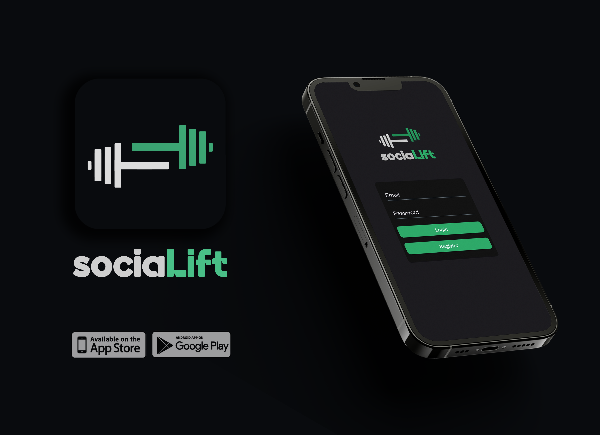

# fe-nc-socialift

Gym social media app

## To View This Project

### `cd fe-sociallift`

Navigate to the React App.

### `npm install`

Install required packages.

### `npm start`

Runs the app in the development mode.

Use Expo to display on mobile device using the QR code.

Alternatively to run on web use...

### `npm run custom`

## Stack

- Javascript
- React Native
- React Native Elements
- Firebase
- NoSQL

## Conclusion

### Why I built this project this way?

We have decided to build this project in React Native, as we only had a small team of 5 developers and 14 days to plan and execute the idea. Using React Native means we can develop on numerous platforms at once, hitting both mobile and web markets. We have also decided to use Firebase in order to gain familiarity with a new database service, and we believed Google's offering will lay a solid foundation for this project.

### I gained confidence...

I personally gained confidence working in a group setting. We were independently been able to come up with an idea, delegate tasks and communicate effectively, in order to come together and develop a full stack application under strict time pressure.

### If we had more time...

If we had more time to work on this project, we would finish the functionality, and improve the styling, including animations.

Some of the functionality that we were unable to complete under the dedicated time limit include

- Dark mode toggle functionality
- Live group chat functionality
- ‘Fun facts’ status section that takes statistics and posts them in a readable manner
- Update database results for likes and comments on statuses
- Display graphs of workout data in groups
- Improve iOS performance
- Add Spotify integration to show what music is listened to
- Add special functionality for gyms, monetising the app

Improve the stylisation by

- Standardising width parameters
- Add loading animation to make the app feel smoother in operation
- Make it more user friendly for web users
- Make font sizes more consistent
